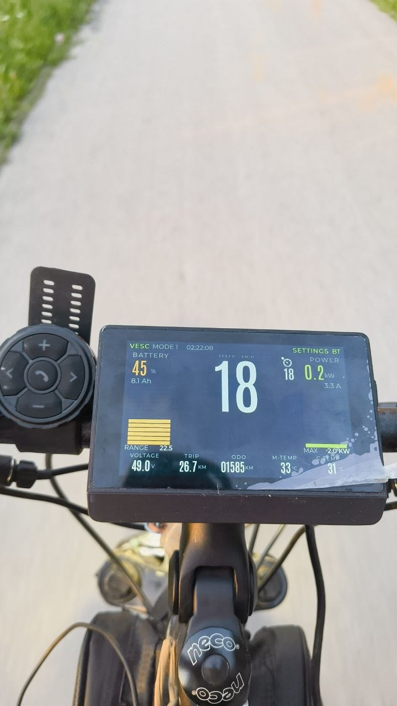

🇷🇺 **Русский** | 🇬🇧 [English](README.md)

# ESP32-P4 Android Auto Head Unit 🚗📱

[](https://github.com/espressif/esp-idf)
[](https://www.espressif.com/en/products/socs/esp32-p4)
[](LICENSE)
[](https://www.waveshare.com/esp32-p4-wifi6-touch-lcd-4.3.htm)
[]()

Беспроводная **Android Auto** магнитола на ESP32-P4 с тач-дисплеем 800×480.
Общается со штатным AA Wireless — **никаких приложений на телефоне не нужно**.
Один раз спарили по Bluetooth — дальше Android Auto сам стартует при каждом
включении. В качестве бонуса — дашборд VESC по CAN-шине для электросамокатов,
велосипедов, DIY-электротранспорта.


> 🎬 Короткое демо на ходу: [`docs/demo.mp4`](docs/demo.mp4)

---

## ✨ Возможности

- 📺 **Нативный Android Auto Wireless** — никаких `Wireless Helper` APK,
  никаких developer-режимов. Телефон коннектится по Classic Bluetooth,
  Android Auto запускается сам.
- 🎞️ **Декодирование H.264** через `esp_h264` (SW-декодер) + PPA-ускоренная
  конверсия YUV420 → RGB565 на ESP32-P4. **Нативно 800×480 @ ~10–15 fps**
  на экране (телефон шлёт ~30 fps; узкое место — SW-декод и шаффл RGB).
- 👆 **Сенсорный ввод** проксируется в телефон (GT911 ёмкостный контроллер).
- 🔔 **Системный аудиоканал** (UI-бипы / клики). Media и Speech каналы
  специально отключены — телефон сам играет звук через свои наушники.
- 🛴 **VESC CAN дашборд оверлей** — батарея %, скорость, температуры моторов
  и FET, ток, индикатор круиз-контроля. В реальном времени.
- 🔵 **BLE NUS мост** — VESC Tool по Bluetooth Low Energy работает *одновременно*
  с Android Auto проекцией.
- 🆙 **HTTP OTA** с прогрессом на экране (`scripts/ota_push.sh`).
- 📦 **Встроенные ко-прошивки**: ESP32-C6 (`esp-hosted` slave) и D1 Mini
  Bluetooth-агент зашиты в основной бинарь и автоматически обновляются по
  SDIO / UART при несовпадении версий.
- ⚙️ **Экран настроек**: WiFi / BT инфо, история подключённых телефонов,
  версии прошивок, просмотр лога из PSRAM ring buffer прямо на экране.

---

## 📺 Скриншоты



<!-- TODO: экран настроек с версиями прошивок и log viewer -->


---

## 🔧 Железо

### Обязательное

| Деталь | Заметки |
|---|---|
| **Waveshare ESP32-P4-WIFI6-Touch-LCD-4.3** | [Магазин](https://www.waveshare.com/esp32-p4-wifi6-touch-lcd-4.3.htm) — главная плата, 800×480 ST7701 MIPI-DSI, GT911 тач, на борту ESP32-C6 для WiFi через SDIO. |
| **D1 Mini ESP32-WROOM-32** | Любая USB-C плата на ESP32 с **Classic Bluetooth**. Делает BT pairing с телефоном (у ESP32-P4 и ESP32-C6 нет BT Classic). ~$3. |
| Провода-перемычки, USB-C кабели | |

### Опциональное

| Деталь | Зачем |
|---|---|
| **TJA1051 CAN-трансивер** (лучше вариант `T/3`) | VESC CAN шина → GPIO P4 |
| **DC-DC step-down 12В → 5В** (≥1 А) | Питание от VESC / батареи автомобиля |
| **Батарейка CR2032** в посадочное место H8 | Бэкап RTC (часы продолжают идти после отключения) |
| **VESC** контроллер с CAN-выходом | Живой HUD-оверлей |

---

## 🔌 Подключение

<!-- TODO: фото с подключением D1 Mini к J3 хедеру -->


### 1. Цепь питания

```
[Батарея 12В / шина VESC]
        │
        ▼
 [DC-DC step-down  12В → 5В,  ≥1 А]
        │
        ▼   (USB-C или 5V pin)
 [Плата Waveshare ESP32-P4]
        │  встроенный LDO
        ▼
       3V3 ──────► D1 Mini ESP32 (3V3 пин)
```

> ⚠️ **D1 Mini питаем от 3.3В шины P4, НЕ от 5В.** Встроенный на D1 Mini AMS1117
> просто будет греть лишний вольт впустую — на J3 хедере P4 уже выдаются чистые
> 3.3 В, ими и питаем.

### 2. D1 Mini ESP32 ↔ ESP32-P4 (UART + OTA)

J3 хедер — нижний торец платы Waveshare, там свободные пины расширения.
USB-C debug консоль (GPIO 37/38) остаётся свободной при этом подключении.

```
D1 Mini сторона             ESP32-P4 (J3 хедер)
─────────────────────────────────────────────────
GPIO 17 (TX2)    ────►      GPIO 22  (UART RX)
GPIO 16 (RX2)    ◄────      GPIO 21  (UART TX)
GPIO 5           ◄────      GPIO 24  (RST, для OTA bt_agent)
EN / IO0         ◄────      GPIO 25  (BOOT, для OTA bt_agent)
3V3              ◄────      3V3
GND              ────       GND
```

RST/BOOT линии позволяют основной прошивке P4 автоматически перепрошивать
BT-агент по UART, если версии разъехались. Так что D1 Mini вы прошиваете
руками **только один раз**.

### 3. VESC CAN шина (опционально — нужно только для HUD оверлея)

```
[VESC CAN_H/CAN_L]──┬── [терминатор 120 Ом, если ещё не стоит на шине]
                    │
              [TJA1051 трансивер, 5В VCC]
                    │
        TXD ◄────── GPIO 48 (P4)            ← 3.3В драйвит TJA1051 TXD напрямую
        RXD ──────► [делитель 5В→3.3В] ──── GPIO 47 (P4)
```

- **Номиналы делителя**: 1.8 кОм (последовательно) + 3.3 кОм (на землю) или
  10 кОм + 18 кОм.
- **TJA1051 vs TJA1051T/3**: если есть выбор — берите **T/3** версию. У неё
  есть отдельный пин `VIO`, который заводят на 3.3В, и тогда делитель на RXD
  не нужен совсем.
- По умолчанию **500 kbps**, controller ID **2** — обе настройки в
  `idf.py menuconfig`, секция *VESC CAN* (`VESC_CAN_SPEED_KBPS`,
  `VESC_CAN_CONTROLLER_ID`).

---

## 🖨️ Корпус под 3D-печать

STL / STEP файлы корпуса лежат в [`3d-model/`](3d-model/). Параметры печати,
рекомендации по материалу и инструкция сборки будут дописываться там по мере
финализации дизайна.

<!-- TODO: рендер или фото распечатанного корпуса -->

---

## 🚀 Сборка и прошивка

### Что нужно

- **ESP-IDF v5.5+** (проверено на v5.5.3).
- Установить оба таргета: `esp32p4` (основная плата) и `esp32` (D1 Mini
  BT-агент).

```bash
git clone --recursive https://github.com/espressif/esp-idf.git
cd esp-idf && ./install.sh esp32,esp32p4
. ./export.sh
```

### 1. Основная прошивка — ESP32-P4

```bash
cd esp32p4-android-auto
idf.py set-target esp32p4
idf.py -p /dev/cu.usbmodem* flash monitor
```

> WiFi прошивка ESP32-C6 (`network_adapter.bin`) встроена в основной бинарь
> через `EMBED_FILES` и заливается на C6 по SDIO при старте, если версии не
> совпадают. Отдельно C6 прошивать не нужно.

### 2. Прошивка BT-агента — D1 Mini ESP32

Делается **один раз**. Дальше P4 сам перепрошивает агент по UART, как только
встроенная версия становится новее.

```bash
cd tools/bt_agent
idf.py set-target esp32
idf.py -p /dev/cu.usbserial-* flash monitor
```

Полный walk-through boot-лога агента и как выглядит SSP pairing — в
[`tools/bt_agent/README.md`](tools/bt_agent/README.md).

### 3. OTA-обновления после первой прошивки

Когда head unit поднял свою SoftAP (по умолчанию IP `192.168.4.1`), можно
пушить новые прошивки по HTTP с ноутбука, подключённого к той же AP:

```bash
scripts/ota_push.sh 192.168.4.1
```

На экране устройства появится прогресс, после загрузки оно ребутнётся в
новый OTA-слот.

---

## 📱 Первое подключение телефона

1. Включить head unit. На экране — **«Waiting for phone»** и SSID / IP
   SoftAP.
2. На телефоне: *Настройки → Bluetooth → Добавить устройство → **ESP32-P4 AA***.
3. Принять SSP pairing prompt на обеих сторонах.
4. Телефон сам подключается к WiFi head unit'а и запускает Android Auto.
   Экран переключается на AA-проекцию.

После первого спаривания head unit запоминает телефон, и каждое следующее
включение — авто-реконнект без диалогов.

---

## 🗺️ Roadmap / Статус

| Что | Статус | Комментарии |
|---|---|---|
| AA Wireless видео (H.264) | ✅ | Нативно 800×480 @ ~10–15 fps; упирается в SW-декод + RGB-шаффл |
| Touch input → телефон | ✅ | GT911 → AA `TouchEvent` protobuf |
| System audio канал | ✅ | UI-бипы; без этого Gearhead вообще отказывается проецировать |
| VESC CAN дашборд | ✅ | Батарея %, скорость, температуры, индикатор круиза |
| BLE NUS (мост VESC Tool) | ✅ | Работает одновременно с AA |
| HTTP OTA + прогресс на экране | ✅ | `scripts/ota_push.sh` |
| Settings UI + log viewer | ✅ | Логи переживают ребут, читаются прямо с устройства |
| Авто-реконнект к последнему телефону | ✅ | NVS bonded list на BT-агенте |
| Media / Speech audio каналы | 🟡 | Отключены намеренно — нет аудио-выхода |
| Чистый BT Classic на P4 (без D1 Mini) | ❌ | Невозможно — у ESP32-P4 нет радио BT Classic |
| Нативный нав-рендер (без AA) | ❌ | Не планируется |

---

## 📁 Структура репозитория

```
.
├── main/                       # Прошивка ESP32-P4 — AA, видео, UI, OTA, VESC, BLE
├── components/
│   ├── esp32_p4_wifi6_touch_lcd_4_3/  # BSP Waveshare (LVGL, ST7701 DSI, GT911 тач)
│   ├── bt_agent_fw/            # Встраиваемый блоб прошивки bt_agent
│   ├── c6_ota_partition/       # Встраиваемая прошивка ESP32-C6 (network_adapter.bin)
│   ├── vesc_can/               # CAN-драйвер для VESC (RT data + LISP poll)
│   ├── vesc_ui/                # UI дашборда VESC оверлей
│   ├── dev_settings/           # Экран настроек + персист
│   ├── log_capture/            # PSRAM ring-buffer логгер
│   └── qr_info/                # QR-код с WiFi creds для телефона
├── tools/
│   ├── bt_agent/               # Прошивка D1 Mini ESP32 (Classic BT + SPP)
│   ├── c6_slave_fw/            # Исходники встроенной C6-прошивки (gitignored, см. CLAUDE.md)
│   └── c6_ota_flasher/         # Запасной standalone-флешер C6
├── scripts/                    # capture.sh (Wireshark), ota_push.sh, extract_yuv.py
├── 3d-model/                   # STL / STEP файлы корпуса под 3D-печать
├── docs/images/                # Фото / скриншоты для этого README
├── research/                   # Reference-исходники апстримов (gitignored)
├── partitions.csv              # Dual-OTA layout (оба слота ниже границы 16 MB)
├── CLAUDE.md                   # Изначальный архитектурный дизайн (Mode A / Mode B)
└── README.md
```

---

## 🙏 Благодарности и ссылки

- [**aasdk**](https://github.com/f1xpl/aasdk) и [**openauto**](https://github.com/f1xpl/openauto) от *f1xpl* — библия AA Wireless протокола.
- [**headunit-revived**](https://github.com/andreknieriem/headunit-revived) от *andreknieriem* — референс по wireless-режимам.
- [**WirelessAndroidAutoDongle**](https://github.com/Nicba1010/WirelessAndroidAutoDongle) от *Nicba1010* — AA-донгл на Raspberry Pi.
- [**esp-h264**](https://github.com/espressif/esp-h264) и [**esp-hosted**](https://github.com/espressif/esp-hosted) от *Espressif*.
- [**Wiki Waveshare ESP32-P4-WIFI6-Touch-LCD-4.3**](https://github.com/waveshareteam/ESP32-P4-WIFI6-Touch-LCD-4.3) — BSP и примеры.

---

## 📜 Лицензия

Распространяется под **GNU General Public License v3.0** — см. [`LICENSE`](LICENSE).
