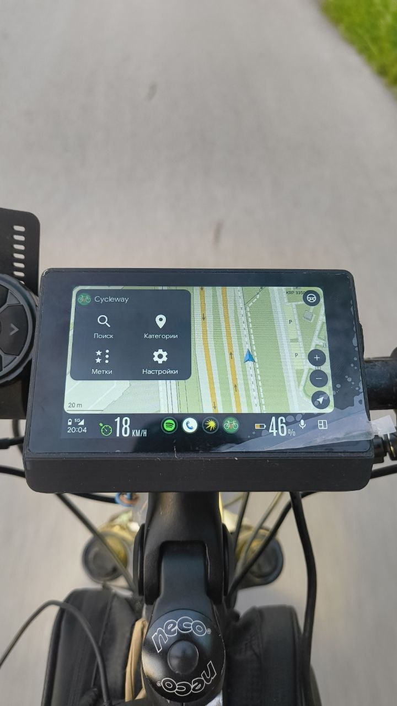
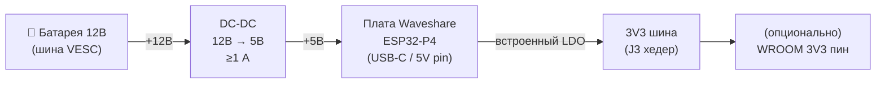
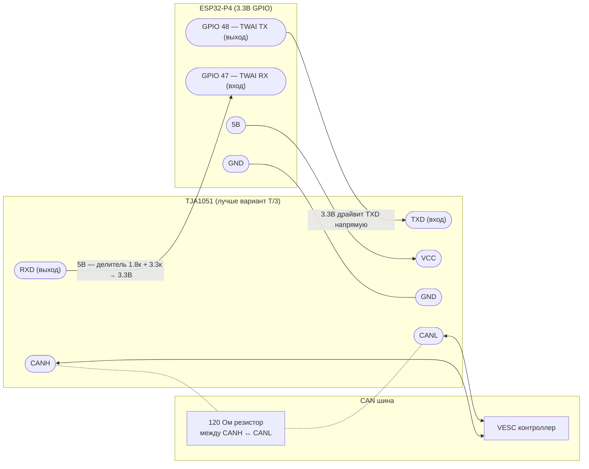
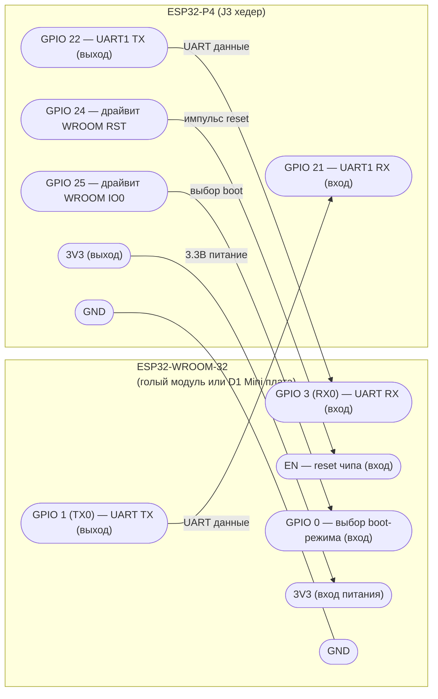

🇷🇺 **Русский** | 🇬🇧 [English](README.md)

# VESC Dashboard на ESP32-P4 🛴⚡

[](https://github.com/espressif/esp-idf)
[](https://www.espressif.com/en/products/socs/esp32-p4)
[](LICENSE)
[](https://www.waveshare.com/esp32-p4-wifi6-touch-lcd-4.3.htm)
[]()

Open-source **800×480 тач-дашборд для VESC-транспорта** — электроскейтов,
электровелосипедов, самокатов, DIY-электромобилей. В реальном времени:
батарея %, скорость, температуры мотора и контроллера, напряжение, ток,
одометр — всё прямо с CAN-шины VESC. Заодно играет роль BLE-моста для
VESC Tool — настраиваешь контроллер прямо во время поездки.

**Бонусом**: то же самое устройство умеет в нативный Android Auto Wireless —
спариваешь телефон по Bluetooth и Google Maps / Spotify / Cycleway проецируются
на тот же экран. Никаких приложений на телефон ставить не надо.



> 🎬 Короткое демо на ходу: [`docs/demo.mp4`](docs/demo.mp4) · [`docs/demo-2.mp4`](docs/demo-2.mp4) · [`docs/demo-3.mp4`](docs/demo-3.mp4)

---

## ✨ Возможности

### 🛴 Основное — VESC дашборд
- **Живая телеметрия по CAN**: батарея %, скорость, напряжение, ток,
  температуры мотора и FET, одометр, trip, остаточный запас хода,
  индикатор круиз-контроля.
- **Учёт поездок** — окно статистики поездки на экране (дистанция, Вт·ч,
  эффективность, графики) + кнопка **Reset trip**; данные пишутся в сырой
  циклический trip-log на выделенном разделе flash `triplog`, переживающий
  перезагрузки.
- **Меню конфигурации VESC Tool прямо на устройстве** — чтение / запись
  motor- и app-конфига контроллера прямо с экрана дашборда, запуск FOC
  detection, бэкапы конфига / поездок — без ноутбука. Таблицы параметров
  кодогенерятся из XML VESC Tool.
- **BLE NUS мост** — VESC Tool по Bluetooth LE общается с контроллером
  через этот дашборд, отдельный адаптер не нужен.
- **Экран настроек** прямо на устройстве: CAN bitrate, controller ID,
  единицы измерения, просмотр лога из PSRAM ring buffer.
- **HTTP OTA** с прогрессом на экране (`scripts/ota_push.sh`).

### 📺 Бонус — беспроводной Android Auto
- Нативная **Android Auto Wireless** проекция на том же 800×480 экране —
  никаких `Wireless Helper` APK, никаких developer-режимов. Один раз
  спариваешь телефон по Classic Bluetooth, дальше AA сам стартует при
  каждом включении.
- Декодирование H.264 через `esp_h264` (SW-декодер) + PPA-ускоренная
  конверсия YUV420 → RGB565. Нативно 800×480 @ ~10–15 fps на экране.
- Сенсорный ввод проксируется в телефон (GT911 ёмкостный контроллер).
- UI-бипы / клики (System audio канал — без него Gearhead отказывается
  проецировать).
- Авто-реконнект к последнему спаренному телефону.


### 📱 Приложение-компаньон (опционально)
`aa_bridge` — небольшое Flutter-приложение ([`flutter-application/`](flutter-application/)),
которое общается с head unit'ом по BLE, независимо от Android Auto:
- **Мост уведомлений и медиа** — уведомления телефона и инфо о текущем треке /
  обложка дублируются на дашборд.
- **Часы** — шлёт локальное время по BLE, чтобы дашборд показывал `HH:MM`
  без RTC / батарейки на устройстве.
- **Прошивка по WiFi** — образ P4 зашит в APK и заливается в head unit по его
  SoftAP прямо с телефона. Креды читаются по BLE автоматически, либо вводятся /
  сканируются вручную.

### 📦 Под капотом
- **Встроенные ко-прошивки**: ESP32-C6 (`esp-hosted` WiFi slave) и D1 Mini
  Bluetooth-агент зашиты в основной бинарь и автоматически обновляются
  по SDIO / UART при несовпадении версий.
- **Dual-OTA** layout в 32 MB flash (оба слота ниже границы 16 MB), плюс
  выделенный раздел `triplog` (~12 MB) над ними под сырой trip-log.

---

## 🔧 Железо

| Деталь | Для чего | Заметки |
|---|---|---|
| **Waveshare ESP32-P4-WIFI6-Touch-LCD-4.3** | всегда | [Магазин](https://www.waveshare.com/esp32-p4-wifi6-touch-lcd-4.3.htm). Главный мозг — ESP32-P4 + ESP32-C6 для WiFi на борту, 800×480 ST7701 MIPI-DSI, GT911 тач. |
| **VESC контроллер с CAN** | VESC дашборд | Любая ревизия с CAN-выходом. Это вообще весь смысл. |
| **TJA1051 CAN-трансивер** (лучше `T/3`) | VESC дашборд | Согласование CAN 5В → 3.3В |
| **DC-DC step-down 12В → 5В** (≥1 А) | VESC дашборд | Питание от VESC / батареи транспорта |
| **Модуль ESP32-WROOM-32** (или любая плата с ним) | бонус AA | Голый модуль WROOM-32 можно припаять прямо к плате P4 — включаешь `BT_AGENT_OTA_ENABLED=y` в `idf.py menuconfig`, и P4 сам его прошивает по UART + RST/BOOT линиям, USB-to-serial не нужен. Если паять не хочется — подойдёт D1 Mini ESP32 (или любая USB-C плата на ESP32 с Classic BT). У ESP32-P4 / C6 нет BT Classic. ~$2–3. |
| Провода-перемычки, USB-C кабели | всегда | |

Если Android Auto не нужен — WROOM можно вообще не ставить, дашборд
работает сам по себе. Если на UART ничего не подключено и
`BT_AGENT_OTA_ENABLED` оставлен в дефолте (`n`), P4 на каждой загрузке
просто молча пропускает всю BT-цепочку.

---

## 🔌 Подключение

<!-- TODO: фото с подключением VESC + D1 Mini к J3 хедеру -->

**Распиновка зависит от платы.** Схемы ниже нарисованы под **Waveshare 4.3"**
(плата по умолчанию). Для **Guition JC4880P443C** бери числа из колонки JC4880;
питание, направления сигналов и делитель на CAN RX — одинаковые для обеих плат.

| Сигнал | Waveshare 4.3" | JC4880P443C |
|---|---|---|
| CAN TX → трансивер TXD | GPIO 48 | GPIO 51 |
| CAN RX ← трансивер RXD | GPIO 47 | GPIO 52 |
| BT-агент: P4 TX → WROOM RX | GPIO 22 | GPIO 33 |
| BT-агент: P4 RX ← WROOM TX | GPIO 21 | GPIO 31 |
| BT-агент RST → WROOM EN | GPIO 24 | GPIO 30 |
| BT-агент IO0 → WROOM GPIO 0 | GPIO 25 | GPIO 29 |

### 1. Цепь питания



> ⚠️ Если ставишь D1 Mini ради AA-бонуса, **питай его от 3.3В шины P4,
> НЕ от 5В**. Встроенный на D1 Mini AMS1117 просто будет греть лишний
> вольт впустую — на J3 хедере P4 уже выдаются чистые 3.3 В.

### 2. VESC CAN шина (основное)



Направления пинов — с точки зрения MCU (стандарт NXP): на TJA1051
**TXD — это вход** (его драйвит MCU), **RXD — это выход** (его драйвит
трансивер в сторону MCU).

- **Номиналы делителя на RXD**: 1.8 кОм (последовательно) + 3.3 кОм (на землю)
  или 10 кОм + 18 кОм.
- **TJA1051 vs TJA1051T/3**: если есть выбор — берите **T/3** версию. У неё
  есть отдельный пин `VIO`, который заводят на 3.3В, и тогда делитель на RXD
  не нужен совсем.
- По умолчанию **500 kbps**, controller ID **2** — обе настройки в
  `idf.py menuconfig`, секция *VESC CAN* (`VESC_CAN_SPEED_KBPS`,
  `VESC_CAN_CONTROLLER_ID`).

#### Двухмоторные (двухголовые) платы

Дуал-ESC (Flipsky Dual, Spintend UBOX, MakerX dual, …) — это **два VESC-узла на
одной CAN-шине**, у каждого свой controller ID. Чтобы задействовать обе головы:

1. В **Настройки → Second head** включите тумблер и задайте **Second head ID** —
   CAN-адрес второго контроллера (первый — это обычный *Target VESC ID*).
2. На **обеих** головах в VESC Tool включите **App → General → Send status over
   CAN** со статус-сообщениями **1–5** на частоте **50 Гц** (дефолт при
   включении) и задайте **разные CAN ID** (например, 0 и 1).

Частота 50 Гц — обязательна, а не «желательна»: ведущий VESC учитывает соседа в
суммарных значениях, только пока статус соседа **свежее 100 мс**, и температуры
второй головы дашборд читает из тех же статус-кадров. На низкой частоте
суммарные Ah/Wh/мощность будут «прыгать».

Что получаем на дуал-плате:

- **Температуры** показываются для обеих голов как `h1/h2` (например, `34/37`);
  если статус второй головы не виден — остаётся одиночное значение.
- **Батарея / Ah / Wh / мощность** — это **суммарные** значения обоих моторов:
  ведущий VESC складывает их сам (мы читаем его *setup*-значения), без лишнего
  опроса по CAN.
- **Скорость, пробег и напряжение** берутся от первой головы.
- **ESC NOT CONNECTED** показывается, если замолчала *любая* из голов.
- В **меню настройки VESC** появляется селектор **Голова 1 / Голова 2** —
  можно читать и писать MCCONF/APPCONF каждой головы отдельно.

### 3. D1 Mini ESP32 ↔ P4 (только если нужен AA-бонус)

J3 хедер — нижний торец платы Waveshare, там свободные пины расширения.
USB-C debug консоль (GPIO 37/38) остаётся свободной при этом подключении.



`EN` / `GPIO 0` — стандартная связка reset + boot-mode у любого ESP32,
именно её дёргает `esp_serial_flasher`. На D1 Mini-плате они уже выведены
на хедер: `EN` подписан как есть, `GPIO 0` обычно сидит на пине `D3`.

RST/BOOT линии позволяют основной прошивке P4 автоматически перепрошивать
BT-агент по UART, если версии разъехались. Так что D1 Mini вы прошиваете
руками **только один раз**.

---

## 🚀 Сборка и прошивка

### Что нужно

- **ESP-IDF v5.5+** (проверено на v5.5.3).
- Установить таргет `esp32p4` обязательно; `esp32` — только если нужен
  Android Auto бонус.

```bash
git clone --recursive https://github.com/espressif/esp-idf.git
cd esp-idf && ./install.sh esp32,esp32p4
. ./export.sh
```

### 1. Основная прошивка — ESP32-P4 (дашборд + AA)

```bash
cd esp32p4-android-auto
idf.py set-target esp32p4
idf.py -p /dev/cu.usbmodem* flash monitor
```

Обычная сборка `idf.py` собирает под плату **Waveshare 4.3"** (по умолчанию).

> WiFi прошивка ESP32-C6 (`network_adapter.bin`) встроена в основной бинарь
> через `EMBED_FILES` и заливается на C6 по SDIO при старте, если версии не
> совпадают. Отдельно C6 прошивать не нужно.

#### Несколько плат

Прошивка поддерживает несколько плат ESP32-P4. Выбор платы —
`scripts/build_board.sh <board> <аргументы idf.py…>`: скрипт использует
отдельную build-директорию и накладывает оверлей `sdkconfig.defaults.<board>`:

| Плата | Slug | Флеш | Примечание |
|---|---|---|---|
| Waveshare ESP32-P4-WIFI6-Touch-LCD-4.3 | `waveshare` | 32 МБ | по умолчанию (это же собирает обычный `idf.py`) |
| Guition JC4880P443C_I_W | `jc4880` | 16 МБ | ST7701S, уменьшенная партишен-таблица (`partitions_16mb.csv`) |

```bash
scripts/build_board.sh                              # собрать прошивки под ВСЕ платы
scripts/build_board.sh waveshare flash monitor
scripts/build_board.sh jc4880 -p /dev/cu.usbmodem* flash monitor
```

Без аргумента (или `all`) — собираются образы под все платы за один прогон.

Что различается по платам (всё остальное — WiFi/SDIO→C6, I2C тача, SD, бо́льшая
часть шины I2S — общее): тайминги MIPI-DSI панели и vendor-init, пины подсветки/
reset LCD, пины UART BT-агента, пины CAN RX/TX, размер флеша и партишен-таблица.
Плата выбирается Kconfig-`choice BOARD_MODEL`
(`CONFIG_BOARD_WAVESHARE_43` / `CONFIG_BOARD_JC4880P443C`); см. ветки
`#if CONFIG_BOARD_JC4880P443C` в BSP и `main/bt_link.h`.

Распиновка того, что подключаешь руками (CAN-трансивер и BT-агент), — в таблице
раздела **🔌 Подключение** выше. Внутренние пины панели JC4880 (подсветка LCD
`23`, reset `5`) заданы в BSP, паять их не нужно.
В 16 МБ влезают две OTA-партиции по 5 МБ + 1 МБ storage + ~4.9 МБ trip log —
у образа (~3.8 МБ) остаётся ~1.2 МБ (24%) запаса в слоте, следи за ростом размера.

### 2. (Опционально) Прошивка BT-агента — D1 Mini ESP32

Нужна только если хочется Android Auto бонус. Два варианта:

**A. Дать P4 прошить её самому (для голого припаянного WROOM — самое то).**
Включаешь `BT_AGENT_OTA_ENABLED=y` в `idf.py menuconfig` (раздел
*Project → BT Agent OTA*) и пересобираешь. На каждой загрузке P4 читает
`BT-VER:` строку с агента по UART и, если версия не совпадает, перешивает
агент блобом из `components/bt_agent_fw/`. Голый припаянный WROOM-32
поднимается полностью провижионированным при первом же включении. (Дефолт
этой опции — `n`; без неё BT-путь становится no-op, даже если WROOM
подключён.)

**B. Прошить руками.** Если есть дев-плата с USB:

```bash
cd tools/bt_agent
idf.py set-target esp32
idf.py -p /dev/cu.usbserial-* flash monitor
```

Полный walk-through boot-лога агента и как выглядит SSP pairing — в
[`tools/bt_agent/README.md`](tools/bt_agent/README.md).

### 3. VESC LISP скрипт — для круиз-контроля и профилей скорости

[`lisp/main.lisp`](lisp/main.lisp) выполняется **на самом VESC контроллере**
(не на P4). Добавляет круиз-контроль по кнопке на PPM-пине `RX`, три
профиля скорости по кнопке на `TX`, и отдаёт состояние круиза в дашборд
по LISP poll каналу — именно это зажигает индикатор круиза на экране.

Открываешь *VESC Tool → VESC Packages → Lisp Scripting*, грузишь
`lisp/main.lisp`, **Upload** → **Activate** → сохранить во flash. Подробности
и как поменять пресеты скорости — в [`lisp/README.md`](lisp/README.md).

Без этого скрипта дашборд продолжает показывать живую телеметрию — только
индикатор круиза и бипы при переключении профилей не работают.

### 4. OTA-обновления после первой прошивки

Когда head unit поднял свою SoftAP (по умолчанию IP `192.168.4.1`), можно
пушить новые прошивки по HTTP с ноутбука, подключённого к той же AP:

```bash
scripts/ota_push.sh 192.168.4.1
```

На экране устройства появится прогресс, после загрузки оно ребутнётся в
новый OTA-слот.

---

## 📱 Как пользоваться

### Режим дашборда (по умолчанию)

Подаёшь питание — на экране сразу появляется дашборд с тем, что VESC
выдаёт по CAN: батарея, скорость, температуры и т.д. Тапнуть в Settings —
там единицы измерения, CAN bitrate, controller ID, просмотр лога.

Параллельно с дашбордом **к устройству можно подключиться из VESC Tool
по Bluetooth LE** (NUS мост) — точно так же, как к любому VESC адаптеру.

### Переключение между режимами

**Тап тремя пальцами** (любые три пальца на экран на ~100 мс) переключает
между **VESC дашбордом** и **Android Auto проекцией**. Жест работает в
обе стороны, в любом режиме, и срабатывает ровно один раз за жест —
пальцы должны полностью оторваться от экрана, чтобы он мог сработать
снова. Так что в AA-режиме он не утечёт в телефон как случайный тач.

### Android Auto бонус (после прошивки BT-агента)

1. На экране в углу также висит **«Waiting for phone»** с SSID / IP
   SoftAP.
2. На телефоне: *Настройки → Bluetooth → Добавить устройство → **ESP32-P4 AA***.
3. Принять SSP pairing prompt.
4. Телефон сам подключается к WiFi head unit'а и запускает Android Auto.
   Экран переключается на AA-проекцию; VESC дашборд продолжает работать
   как оверлей (батарея %, скорость) поверх видео AA.

После первого спаривания head unit запоминает телефон, и каждое следующее
включение — авто-реконнект без диалогов.

### Приложение-компаньон (уведомления, медиа, часы, прошивка по WiFi)

Опциональное Android-приложение в [`flutter-application/`](flutter-application/).
Сборка и установка:

```bash
cd flutter-application
flutter build apk --release
adb install -r build/app/outputs/flutter-apk/app-release.apk
```

- **Пейринг**: открываешь приложение → оно сканит head unit по BLE → тапаешь,
  чтобы подключиться. Дальше — авто-реконнект.
- **Уведомления / медиа**: выдай разрешение на доступ к уведомлениям по
  запросу; уведомления телефона и инфо о треке появятся на дашборде. Часы на
  дашборде начинают показывать `HH:MM`, как только приложение подключилось.
- **Прошивка по WiFi**: *Home → Обновить прошивку устройства*. Приложение
  читает креды SoftAP по BLE (или сканируешь / вводишь вручную), подключается
  к этому WiFi и заливает прошивку, зашитую в APK. Head unit проверяет образ и
  перезагружается на новую версию — не выключай его до конца. Образ кладётся из
  `build/` скриптом [`scripts/stage_firmware_asset.sh`](scripts/stage_firmware_asset.sh).

---

## 🗺️ Roadmap / Статус

| Что | Статус | Комментарии |
|---|---|---|
| VESC RT-данные по CAN | ✅ | Батарея %, скорость, напряжение, ток, температуры, одометр |
| Окно статистики поездки + персистентный trip-log | ✅ | Метрики / графики по поездке + Reset trip; сырой циклический лог на разделе `triplog` |
| Меню конфигурации VESC Tool на устройстве + FOC detection | ✅ | Чтение / запись конфига контроллера с экрана; таблицы параметров из XML VESC Tool |
| VESC LISP poll | ✅ | Индикатор круиза + кастомные счётчики (требует [`lisp/main.lisp`](lisp/main.lisp) залитого в контроллер) |
| BLE NUS мост (VESC Tool по BLE) | ✅ | Работает одновременно с AA |
| Приложение — мост уведомлений / медиа / часы | ✅ | Flutter `aa_bridge` по BLE |
| Приложение — прошивка по WiFi | ✅ | Зашитый образ POST'ится на OTA-эндпоинт SoftAP head unit'а |
| Settings UI + log viewer | ✅ | Логи переживают ребут, читаются прямо с устройства |
| HTTP OTA + прогресс на экране | ✅ | `scripts/ota_push.sh` |
| (Бонус) AA Wireless видео (H.264) | ✅ | Нативно 800×480 @ ~10–15 fps; упирается в SW-декод + RGB-шаффл |
| (Бонус) Touch input → телефон | ✅ | GT911 → AA `TouchEvent` protobuf |
| (Бонус) System audio канал | ✅ | UI-бипы; без них Gearhead не проецирует вообще |
| (Бонус) Авто-реконнект к последнему телефону | ✅ | NVS bonded list на BT-агенте |
| Media / Speech audio каналы | 🟡 | Отключены намеренно — нет аудио-выхода |
| Чистый BT Classic на P4 (без D1 Mini) | ❌ | Невозможно — у ESP32-P4 нет радио BT Classic |

---

## 🖨️ Корпус под 3D-печать

STL / STEP файлы корпуса лежат в [`3d-model/`](3d-model/). Параметры печати,
рекомендации по материалу и инструкция сборки будут дописываться там по мере
финализации дизайна.

<!-- TODO: рендер или фото распечатанного корпуса -->

---

## 📁 Структура репозитория

```
.
├── main/                       # Прошивка ESP32-P4 — VESC, UI, AA, OTA, BLE
├── components/
│   ├── esp32_p4_wifi6_touch_lcd_4_3/  # BSP Waveshare (LVGL, ST7701 DSI, GT911 тач)
│   ├── vesc_can/               # CAN-драйвер для VESC (RT data + LISP poll)
│   ├── vesc_ui/                # UI дашборда — тонкая обёртка; реальный UI-код глобится из Super_VESC_Display/{generated,custom}/
│   ├── vesc_config/            # Меню конфигурации VESC Tool на устройстве (таблицы параметров из XML, FOC detection)
│   ├── trip_log/               # Сырой циклический trip-log на выделенном разделе triplog
│   ├── dev_settings/           # Экран настроек + персист
│   ├── log_capture/            # PSRAM ring-buffer логгер
│   ├── bt_agent_fw/            # Встраиваемый блоб прошивки bt_agent (AA бонус)
│   ├── c6_ota_partition/       # Встраиваемая прошивка ESP32-C6 (network_adapter.bin)
│   └── qr_info/                # QR-код с WiFi creds для телефона
├── Super_VESC_Display/         # Проект NXP GUI Guider — исходник UI дашборда (generated/ + custom/), компилируется в прошивку через vesc_ui
├── tools/
│   ├── bt_agent/               # Прошивка D1 Mini ESP32 (Classic BT + SPP)
│   ├── c6_slave_fw/            # Исходники встроенной C6-прошивки (gitignored, см. CLAUDE.md)
│   └── c6_ota_flasher/         # Запасной standalone-флешер C6
├── scripts/                    # capture.sh (Wireshark), ota_push.sh, extract_yuv.py, release.sh
├── lisp/                       # VESC LISP скрипт (круиз + профили скорости) — выполняется на VESC, не на P4
├── 3d-model/                   # STL / STEP файлы корпуса под 3D-печать
├── release/                    # Версионированные артефакты релиза (.bin P4 + .apk приложения)
├── docs/images/                # Фото / скриншоты для этого README
├── research/                   # Reference-исходники апстримов (gitignored)
├── partitions.csv              # Dual-OTA layout (оба слота ниже 16 MB) + раздел triplog
├── CLAUDE.md                   # Изначальный архитектурный дизайн / история
└── README.md
```

---

## 🙏 Благодарности и ссылки

- **[Проект VESC](https://vesc-project.com/)** от *Benjamin Vedder* —
  open-source мотор-контроллер, ради которого этот дашборд и существует.
- [**aasdk**](https://github.com/f1xpl/aasdk) и [**openauto**](https://github.com/f1xpl/openauto) от *f1xpl* — референс по AA Wireless протоколу (для бонусного режима).
- [**headunit-revived**](https://github.com/andreknieriem/headunit-revived) от *andreknieriem* — референс по wireless-режимам.
- [**esp-h264**](https://github.com/espressif/esp-h264) и [**esp-hosted**](https://github.com/espressif/esp-hosted) от *Espressif*.
- [**Wiki Waveshare ESP32-P4-WIFI6-Touch-LCD-4.3**](https://github.com/waveshareteam/ESP32-P4-WIFI6-Touch-LCD-4.3) — BSP и примеры.

---

## 📜 Лицензия

Распространяется под **GNU General Public License v3.0** — см. [`LICENSE`](LICENSE).
